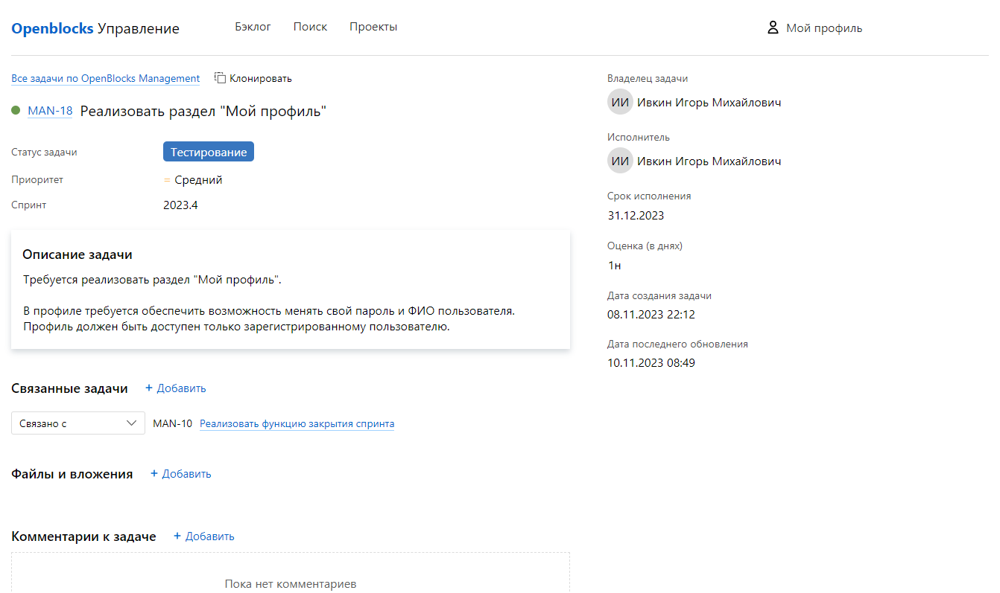
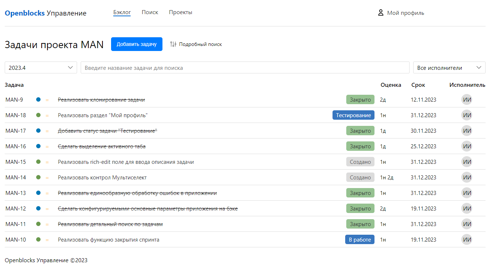

# Фронтенд для проекта "OpenBlocks Управление"



Приложение "Управление" &mdash; это система управления задачами и дефектами. В первую очередь она
предназначена для пользователей, которые ведут разработку программного обеспечения, но подходит
и для других сфер деятельности.



## Как запустить

### Предварительные требования

Для работы приложения потребуется backend в виде REST API, который реализуется в рамках родственного проекта
[OpenBlocks Management](https://github.com/IgorIvkin/openblocks-management).

Вы можете запустить приложение и без бэкенда, но практически все взаимодействия не будут работоспособными.


### Docker
Наиболее простым способом запустить сервис является развертывание в **Docker**.

Вместе с сервисом поставляется простой `Dockerfile` и `docker-compose.yml`. Для запуска склонируйте себе
репозиторий и запустите команду:

    docker-compose up -d

Для запуска в Docker вам не потребуется иметь на компьютере Node.js и Nginx.

После развертывания приложение будет доступно на вашем компьютере по адресу http://localhost.

Вы можете скорректировать порт, на котором будет работать приложение, для этого в файле `docker-compose.yml`
измените первый порт в следующей секции на желаемый.
```yaml
ports:
  - "80:80"
```

Например, если вы укажете `"3000:80"`, то приложение будет доступно по адресу http://localhost:3000.


### Ручной запуск в режиме разработки
Запустите следующую команду

    npm run start

Эта команда поднимает development-сервер с приложением. Оно будет доступно по адресу http://localhost:3000.

### Ручной запуск с ручным развертыванием
Вначале вам потребуется собрать приложение, для этого потребуется **Node.js** версии 18.

    npm run build

В результате сборки вы получите готовые статические файлы в папке `build`.
Далее разместите эти файлы под управлением любого веб-сервера по вашему выбору,
в качестве главной страницы требуется использовать `build/index.html`.

Также обратите внимание, что для корректной работы приложения требуется все неизвестные
маршруты (к несуществующим файлам) также направлять на `build/index.html`.

Например, для `nginx` это можно сделать с помощью следующих настроек.

```
location / {
    try_files $uri /index.html;
}
```

### Техническое описание

Сервис написан на языке программирования Javascript. Для сборки проекта потребуется
**Node.js** LTS версии 18.

Используется фреймворк React.


### Системные требования
| Требование       |        Версия         |
|------------------|:---------------------:|
| Node.js          |          18           |
| Operating system | Windows, Linux, MacOS |

## Об инициативе OpenBlocks
Инициатива OpenBlocks — это проекты с открытым исходным кодом. 
Основная цель состоит в том, чтобы предоставить открытые и расширяемые решения для
пользователей любого масштаба.
